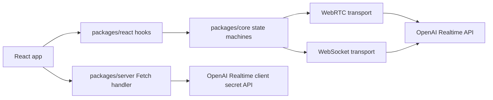

# Realtime Speech Library Architecture

## Goal

Build a TypeScript library for independent speech-to-text and text-to-speech workflows on top of OpenAI's Realtime API, with React hooks as the primary public interface.

The initial API should feel like this:

```ts
const {
  isListening,
  startNew,
  stop,
  reset,
  transcript,
  error,
} = useSpeechToText({
  onStreamChunk: (chunk) => setText((old) => old + chunk),
});

const {
  sendText,
  preconnect,
  isStreaming,
  queueSize,
  error,
} = useTextToSpeech({
  onStreamChunk: (chunk) => audioPlayer.enqueue(chunk),
});
```

The hooks are independent for v1. A full-duplex voice-agent hook can be added later, but it should not shape the first implementation.

## Architecture Status

The exploratory spike has settled the v1 architecture enough to continue implementation. The important result is that live transcript preview and finalized utterance commits are separate concerns.

Settled for v1:

- STT uses OpenAI Realtime over WebRTC with `gpt-realtime-whisper`.
- STT live UI text comes from transcript delta events.
- STT utterance commits are driven by client-side VAD/manual `input_audio_buffer.commit`, not OpenAI `server_vad`.
- TTS uses OpenAI Realtime over WebSocket so the library owns raw PCM audio chunks.
- Browser clients use ephemeral client secrets minted by an app server; standard OpenAI API keys stay server-side.
- Public React hooks remain independent: `useSpeechToText`, `useTextToSpeech`, and `usePcmPlayer`.
- OpenAI/provider transport details stay in `@realtime-speech/core`, with React hooks exposing a small high-level API.

Still provisional:

- The exact custom VAD strategy contract.
- Whether `server_vad` or `semantic_vad` should become high-level STT modes later.
- Whether a full-duplex realtime audio session hook belongs in this library or a companion package.
- Whether raw Realtime events should be exposed through an opt-in debug surface.
- Mobile browser behavior until iOS Safari and Android Chrome are manually tested.
- OpenAI Realtime limits and model behavior should be revalidated against current official docs before publishing.

## Non-goals for v1

- No full-duplex assistant session.
- No tool calling, agent memory, or conversation orchestration.
- No raw OpenAI event surface in the public React API.
- No framework-specific server package beyond a generic Fetch handler.
- No CJS build.
- No broad raw Realtime session override API in the hooks.

## Deferred Roadmap: Realtime Audio Session

A full-duplex realtime audio session hook is a future roadmap item, not part of the v1 STT/TTS surface.

This would target the OpenAI realtime-console style workflow:

```text
microphone audio -> WebRTC media track -> OpenAI Realtime
model audio -> WebRTC remote media track -> browser audio element
JSON client/server events <-> WebRTC data channel
```

Potential public shape:

```ts
const {
  startSession,
  stopSession,
  sendClientEvent,
  sendTextMessage,
  isSessionActive,
  events,
  localStream,
  remoteStream,
  error,
} = useRealtimeAudioSession({ auth });
```

Reference implementation to revisit later:

- [openai/openai-realtime-console](https://github.com/openai/openai-realtime-console)
- Temporary local exploration clone: `/private/tmp/openai-realtime-console`

Use that repo as inspiration for session setup ergonomics: `RTCPeerConnection`, `getUserMedia`, remote audio through `pc.ontrack`, and Realtime JSON events over a WebRTC data channel. Do not let this future hook blur the v1 distinction between transcription-focused STT, chunk-focused TTS, and full-duplex agent sessions.

## Package Layout

Use a pnpm workspace with separate ESM-only packages:

```txt
packages/
  core/
    src/
      audio/
      errors/
      realtime/
      stt/
      transport/
      tts/
  react/
    src/
      usePcmPlayer.ts
      useSpeechToText.ts
      useTextToSpeech.ts
  server/
    src/
      createRealtimeSessionHandler.ts
apps/
  demo/
    src/
      App.tsx
      main.tsx
```

Package responsibilities:

- `@realtime-speech/core`: framework-agnostic session state machines, transports, OpenAI event parsing, queueing, PCM helpers, and provider interfaces.
- `@realtime-speech/react`: React hooks over `core`. React is a peer dependency.
- `@realtime-speech/server`: generic Fetch API handler for minting OpenAI Realtime client secrets.
- `apps/demo`: Vite React demo app used as manual QA and reference integration.

Use the temporary package scope `@realtime-speech/*` for local development. Rename before publishing if a real organization or npm scope is chosen later.

## High-level Flow



The browser never receives the standard OpenAI API key. It only receives short-lived client secrets created by the app server.

## Authentication Model

The default auth path is browser-direct with an ephemeral client secret:

1. React hook calls `getClientSecret`.
2. App backend uses `OPENAI_API_KEY` to create an OpenAI Realtime client secret.
3. Backend returns only the client secret payload.
4. Browser connects directly to OpenAI Realtime using that client secret.

OpenAI's WebRTC docs say ephemeral tokens are minted server-side with a standard API key, and that standard OpenAI API keys must only be used on the server, not in the browser. The docs also recommend setting `OpenAI-Safety-Identifier` on the server-side request that creates the client secret.

Sources:

- [Realtime WebRTC: creating an ephemeral token](https://developers.openai.com/api/docs/guides/realtime-webrtc#creating-an-ephemeral-token)
- [Realtime client secrets API](https://developers.openai.com/api/docs/api-reference/realtime-sessions)
- [Safety identifiers](https://developers.openai.com/api/docs/guides/safety-best-practices#implement-safety-identifiers)

The architecture should not block a future server-proxy mode. Keep auth represented as a strategy:

```ts
type RealtimeAuth =
  | {
      mode: "ephemeral";
      getClientSecret: () => Promise<string>;
    }
  | {
      mode: "proxy";
      url: string;
      getAuthHeaders?: () => Promise<Record<string, string>>;
    };
```

Only `mode: "ephemeral"` is implemented in v1.

## Transport Choices

Use best-fit transports:

- STT v1: WebRTC by default.
- TTS v1: WebSocket by default.

Why:

- OpenAI recommends WebRTC over WebSocket for browser and mobile clients because it is more robust and consistent for realtime media.
- STT benefits from browser-native microphone capture and WebRTC media transport.
- TTS needs raw audio chunk ownership. OpenAI's docs state that WebSocket audio output is delivered through `response.output_audio.delta` events containing Base64-encoded chunks, and that `response.output_audio.done` and `response.done` do not contain the actual audio bytes.

Sources:

- [Realtime WebRTC](https://developers.openai.com/api/docs/guides/realtime-webrtc)
- [Realtime WebSocket](https://developers.openai.com/api/docs/guides/realtime-websocket)
- [Working with audio output from a WebSocket](https://developers.openai.com/api/docs/guides/realtime-conversations#working-with-audio-output-from-a-websocket)

Transport abstraction:

```ts
interface RealtimeTransport {
  connect(config: RealtimeConnectConfig): Promise<void>;
  send(event: RealtimeClientEvent): void;
  close(reason?: string): void;
  onEvent(listener: (event: RealtimeServerEvent) => void): () => void;
  onStatus(listener: (status: RealtimeTransportStatus) => void): () => void;
}
```

The React hooks should not know whether events arrive over WebRTC data channels or WebSocket messages.

## Speech-to-text

`useSpeechToText` is a transcription-only hook, not a voice-agent hook.

Default behavior:

- Lazy-connect on `startNew`.
- Use WebRTC for browser/mobile microphone input.
- Emit both raw transcript deltas and maintained transcript snapshots.
- Support `single` and `continuous` modes.
- Expose `mediaStream` and normalized `audioLevel` for UI meters.
- Use client-side VAD/auto-commit with `gpt-realtime-whisper` for live dictation.
- Keep raw OpenAI server events internal.

Public shape:

```ts
type SpeechToTextMode = "single" | "continuous";

type TranscriptUpdate = {
  utteranceId: string;
  delta: string;
  text: string;
  isFinal: boolean;
  startedAt?: number;
  endedAt?: number;
  confidence?: number;
};

type SpeechToTextOptions = {
  auth: RealtimeAuth;
  mode?: SpeechToTextMode;
  boundaryDetection?: "client_vad" | "manual" | "server_vad";
  language?: string;
  onStreamChunk?: (delta: string) => void;
  onTranscriptUpdate?: (update: TranscriptUpdate) => void;
  onFinal?: (utterance: TranscriptUpdate) => void;
  onAudioLevel?: (level: number) => void;
};

type SpeechToTextState = {
  status: "idle" | "connecting" | "listening" | "stopping" | "error";
  isListening: boolean;
  transcript: string;
  currentUtterance: TranscriptUpdate | null;
  mediaStream: MediaStream | null;
  audioLevel: number;
  error: RealtimeSpeechError | null;
  startNew: () => Promise<void>;
  stop: () => void;
  reset: () => void;
};
```

OpenAI transcription sessions emit incremental events with `conversation.item.input_audio_transcription.delta` and final events with `conversation.item.input_audio_transcription.completed`. Final transcript events from different turns are not guaranteed to arrive in order, so the implementation must key by OpenAI `item_id`.

Source:

- [Realtime transcription](https://developers.openai.com/api/docs/guides/realtime-transcription)

### VAD and model selection

The desired v1 user experience is live dictation with automatic utterance boundaries. The spike showed that OpenAI server VAD is not the right default for that behavior.

Observed behavior:

- `gpt-realtime-whisper` transcription sessions produce live transcript deltas while speaking.
- OpenAI docs state that `gpt-realtime-whisper` requires turn detection to be omitted or set to `null`, then audio must be committed manually.
- `server_vad` is useful for automatic turn boundaries, but it commits/chunks audio when the speaker pauses. In practice this means transcript output is turn-based rather than live word-by-word dictation.

Therefore v1 should default to:

- `gpt-realtime-whisper` for live transcript deltas.
- Client-side VAD for speech start/stop detection.
- Automatic `input_audio_buffer.commit` after local silence detection.
- Adaptive silence detection during continuous dictation so finalized utterance chunks arrive quickly after natural pauses without hard timed cuts.

The public API can still expose this as VAD-style behavior, but the default implementation is local/client VAD rather than OpenAI server VAD:

```ts
useSpeechToText({
  mode: "continuous",
  boundaryDetection: "client_vad",
  vad: {
    silenceDurationMs: 600,
    minSpeechMs: 150,
    adaptive: {
      afterSpeechMs: 1600,
      stopThreshold: 0.04,
      silenceDurationMs: 250,
    },
  },
  onStreamChunk,
  onTranscriptUpdate,
  onFinal,
});
```

This keeps the two latency paths separate:

- `onStreamChunk` remains the near-instant text path from OpenAI transcript deltas.
- `onFinal` remains silence-driven. Continuous mode starts with a conservative detector, then enables a more eager detector for longer speech segments.

`server_vad` can remain a future high-level option for turn-based transcription where final utterance boundaries matter more than immediate text display.

Source:

- [Realtime transcription](https://developers.openai.com/api/docs/guides/realtime-transcription)
- [Realtime VAD](https://developers.openai.com/api/docs/guides/realtime-vad)

## Text-to-speech

`useTextToSpeech` converts text into streamed raw PCM chunks. It does not own playback by default.

Default behavior:

- Lazy-connect on first `sendText`.
- Expose `preconnect` to reduce first-audio latency.
- Use WebSocket to receive raw `response.output_audio.delta` chunks.
- Decode Base64 to PCM16 before emitting to consumers.
- Queue `sendText` calls by default.
- Return a cancellable handle instead of a promise.
- Enforce a configurable conservative `maxTextChars` guard.

Public shape:

```ts
type AudioChunk = {
  data: ArrayBuffer;
  format: "pcm16";
  sampleRate: 24000;
  channels: 1;
  responseId: string;
  itemId: string;
  index: number;
};

type TextToSpeechHandle = {
  id: string;
  cancel: () => void;
};

type TextToSpeechOptions = {
  auth: RealtimeAuth;
  voice?: string;
  speed?: number;
  maxTextChars?: number;
  onStreamChunk?: (chunk: AudioChunk) => void;
  onItemStart?: (item: TtsQueueItem) => void;
  onItemDone?: (item: TtsQueueItem) => void;
  onItemError?: (event: { item: TtsQueueItem; error: RealtimeSpeechError }) => void;
  onTextTooLong?: (event: { text: string; maxTextChars: number }) => void;
};

type TextToSpeechState = {
  status: "idle" | "connecting" | "ready" | "streaming" | "paused" | "error";
  isConnected: boolean;
  isStreaming: boolean;
  queueSize: number;
  currentItem: TtsQueueItem | null;
  error: RealtimeSpeechError | null;
  preconnect: () => Promise<void>;
  sendText: (text: string) => TextToSpeechHandle;
  cancelCurrent: () => void;
  clearQueue: () => void;
  cancelAll: () => void;
};
```

### Queueing semantics

Default behavior is FIFO queueing:

```ts
sendText("A"); // starts if idle
sendText("B"); // waits for A to finish
sendText("C"); // waits for B to finish
```

The hook starts the next item only after the current OpenAI response is complete or fails. `cancelCurrent` cancels the active response and advances to the next queued item. `cancelAll` cancels the active response and clears the queue.

Errors are per item. A global `error` field can expose the latest error for simple UIs, but callbacks must identify the failed queue item.

### Text length guard

Default `maxTextChars` is `8000`.

This is a conservative library guard, not an official OpenAI limit. Realtime limits are token/context based. OpenAI's Realtime cost and truncation docs describe conversation truncation when token limits are exceeded; for a 32k context model with a 4,096 token max output, only 28,224 tokens can fit in context before truncation. The Realtime API reference also allows configuring max output tokens per response.

The smaller character guard keeps generated speech responsive, makes queue behavior predictable, and prevents accidentally sending very large text blocks through a low-latency streaming interface. Consumers can raise or disable it later if needed.

Sources:

- [Realtime cost and truncation](https://developers.openai.com/api/docs/guides/realtime-costs#truncation)
- [Realtime API reference](https://developers.openai.com/api/reference/resources/realtime)

## TTS Provider Boundary

The public TTS hook should be provider-oriented even though v1 only implements OpenAI Realtime.

```ts
interface TextToSpeechProvider {
  preconnect?(): Promise<void>;
  synthesize(item: TtsQueueItem, sink: AudioChunkSink): CancelFn;
  close(): void;
}

type AudioChunkSink = {
  write(chunk: AudioChunk): void;
  done(): void;
  error(error: RealtimeSpeechError): void;
};
```

Future providers could include:

- OpenAI non-Realtime speech endpoint for simpler paragraph-to-audio cases.
- Server-proxy TTS provider.
- Browser-native fallback for demos or offline tests.

## PCM Player Helper

Include a small optional player helper because the demo app needs it and consumers should not have to write Web Audio boilerplate.

Core helper:

```ts
const player = createPcmPlayer({
  sampleRate: 24000,
  channels: 1,
});

player.enqueue(chunk);
player.play();
player.pause();
player.stop();
player.clear();
```

React helper:

```ts
const player = usePcmPlayer({ sampleRate: 24000, channels: 1 });

useTextToSpeech({
  auth,
  onStreamChunk: player.enqueue,
});
```

Player responsibilities:

- Accept PCM16 chunks.
- Convert PCM16 to Float32.
- Queue buffers into Web Audio.
- Expose `isPlaying`, `bufferedMs`, `play`, `pause`, `stop`, and `clear`.
- Stay OpenAI-agnostic.

Mobile browsers may require `AudioContext.resume()` from a user gesture. The demo should surface this by having explicit play/start buttons rather than relying on autoplay.

## Server Package

Start with a generic Fetch API handler:

```ts
import { createRealtimeSessionHandler } from "@realtime-speech/server";

export const POST = createRealtimeSessionHandler({
  apiKey: process.env.OPENAI_API_KEY!,
  getSafetyIdentifier: async (request) => {
    const user = await getUser(request);
    return user ? hashUserId(user.id) : undefined;
  },
});
```

Handler responsibilities:

- Accept only `POST`.
- Optionally call a user-provided auth function before minting a client secret.
- Build an OpenAI Realtime session config from high-level defaults.
- Send the standard OpenAI API key only from the server.
- Set `OpenAI-Safety-Identifier` when available.
- Return only the client secret and safe metadata needed by the browser.
- Normalize OpenAI and network errors into a small JSON error shape.

Framework helpers can be added later as thin wrappers around the generic handler.

## Demo App

The demo app is part of v1.

It should prove:

- Ephemeral-token server flow.
- Mobile microphone permission behavior.
- WebRTC STT connection lifecycle.
- Single and continuous STT modes.
- Live transcript deltas and final transcript reconciliation.
- Audio level meter.
- WebSocket TTS streaming.
- FIFO TTS queueing.
- PCM player playback, pause, stop, clear, and buffered time.
- Cancellation cleanup.

Keep the demo utilitarian and dense. It is a QA surface, not a landing page.

## Internal Observability

Raw OpenAI events remain internal in v1, but the core should use an internal observer/event bus:

```ts
type InternalRealtimeObserver = {
  onRealtimeEvent?: (event: RealtimeServerEvent) => void;
  onTransportStatus?: (status: RealtimeTransportStatus) => void;
};
```

This leaves room for a future public debug option:

```ts
debug?: {
  onRealtimeEvent?: (event: RealtimeServerEvent) => void;
}
```

## Error Model

Use typed library errors instead of leaking raw DOM/OpenAI/network errors everywhere.

```ts
type RealtimeSpeechErrorCode =
  | "auth_failed"
  | "permission_denied"
  | "unsupported_browser"
  | "connection_failed"
  | "session_expired"
  | "invalid_state"
  | "text_too_long"
  | "provider_error"
  | "unknown";

type RealtimeSpeechError = {
  code: RealtimeSpeechErrorCode;
  message: string;
  cause?: unknown;
  retryable: boolean;
};
```

Hook `error` fields expose the latest error for simple rendering. Item-level callbacks carry the specific queue item when relevant.

## Mobile and Browser Constraints

Support modern Chromium, Safari, and Firefox browsers where `RTCPeerConnection`, `getUserMedia`, `WebSocket`, and Web Audio are available.

Implementation requirements:

- Feature-detect required browser APIs.
- Require HTTPS outside local development for microphone access.
- Handle denied, missing, or revoked microphone permissions.
- Stop microphone tracks on `stop`, unmount, and error cleanup.
- Close peer connections and WebSockets on unmount.
- Avoid autoplay assumptions for audio output.
- Test iOS Safari and Chrome Android before treating mobile support as done.

## Build and Test Tooling

Use:

- pnpm workspaces.
- TypeScript.
- ESM-only packages.
- `tsup` for package builds.
- Vite for the demo app.
- Vitest for unit tests.

Test targets:

- OpenAI event parsers with fixture events.
- STT transcript accumulator with out-of-order final events.
- TTS FIFO queue and cancellation transitions.
- PCM16 decode and player buffer math.
- Server handler auth, method, and error behavior.
- React hook lifecycle cleanup with mocked transports.

## Implementation Order

1. Scaffold pnpm workspace, packages, and demo app.
2. Add shared types, error model, and package exports.
3. Build server client-secret handler.
4. Build transport interfaces and mocked transports for tests.
5. Implement client-side VAD/auto-commit around `gpt-realtime-whisper`.
6. Implement WebRTC STT transport and `useSpeechToText`.
7. Implement WebSocket TTS provider, queue, and `useTextToSpeech`.
8. Implement PCM player and `usePcmPlayer`.
9. Wire demo app to the local server route.
10. Add focused tests and run manual browser/mobile QA.

## Open Questions

- Should `semantic_vad` be exposed later as a high-level STT option?
- Should `sendText` support per-call behavior overrides such as `interrupt` or `reject` after the queueing default is stable?
- Should the server package own rate limiting hooks or only expose auth/safety hooks?
